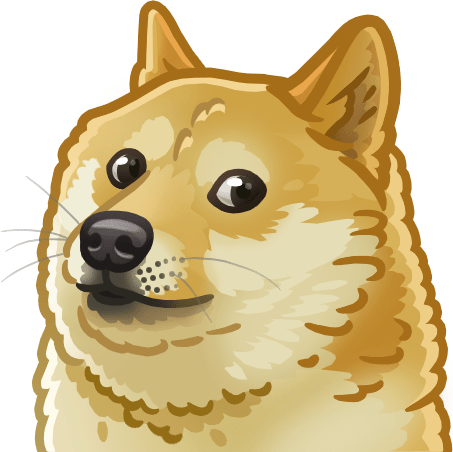

# Barely QR Code standard

## How it works

The Barely QR standard consists of a 15x15 grid of bits segmented into groups of 5 bits. This enables each group to represent one of 32 characters. Supported characters are lowercase english letters, /, :, ?, space, and blank. The top left 5x5 segment is reserved for the doge identification tile that enables unmatched performance for cameras to start reading the bits.
Maximum storage capacity for bits is (15^2 - 25(doge identifier)) = 200 bits. And since 5 bits are used for each character 200 / 5 = 40 characters can be stored.

## Available Scripts

In the project directory, you can run:

### `yarn start`
